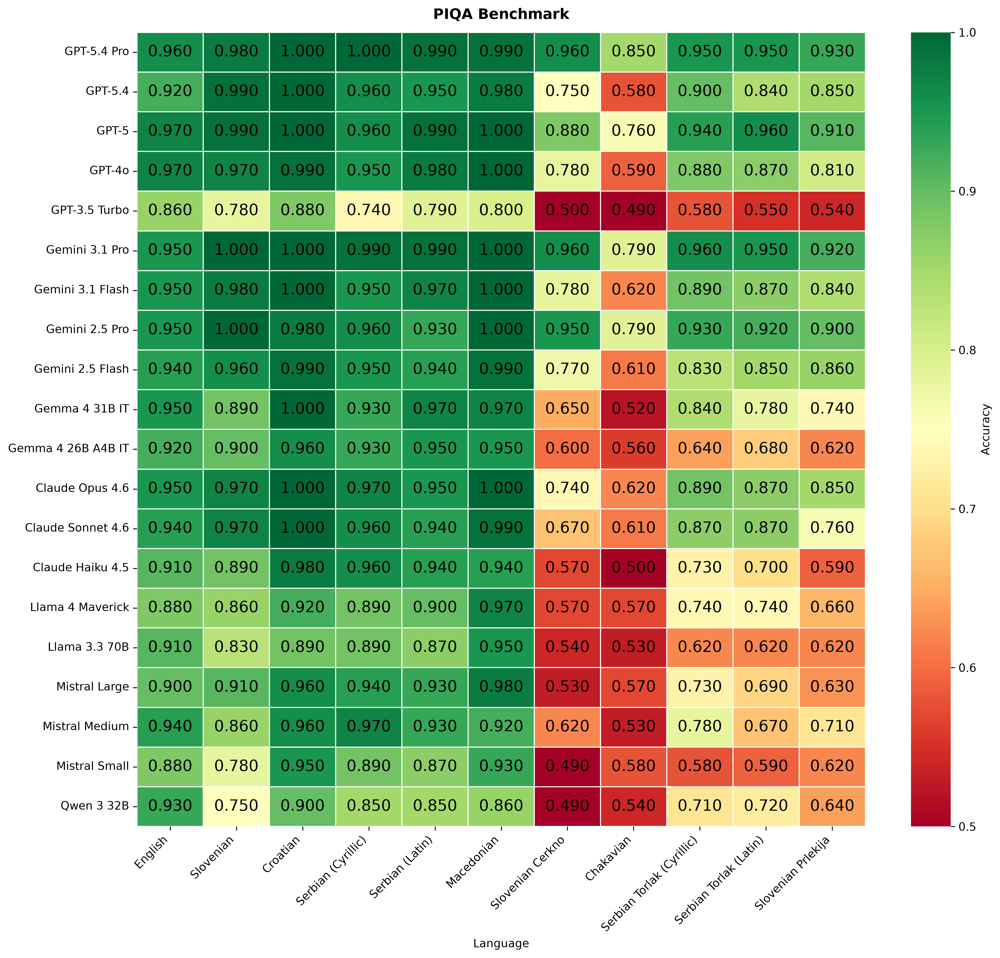
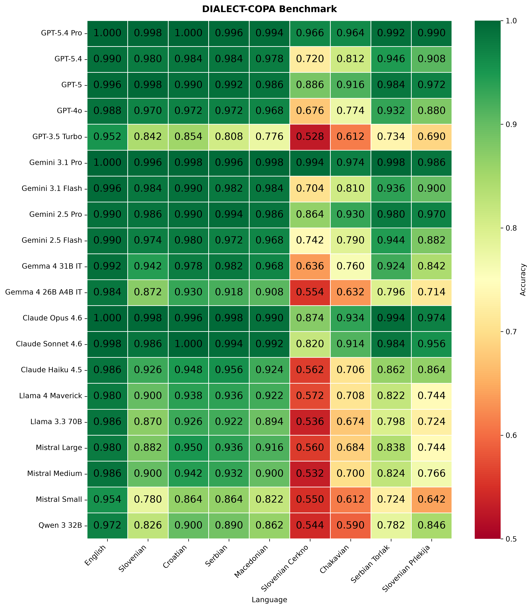

# Slavic-Dialect LLM Benchmarks

[](https://www.python.org/)
[](https://openrouter.ai/)

Zero-shot evaluation of large language models on **commonsense reasoning in
South-Slavic languages, scripts, and dialects**. How well do frontier and open
models reason in Croatian, Serbian, Slovenian, and Macedonian — and how much do
they *degrade* on low-resource dialects like Chakavian, Torlak, and the Cerkno
and Prlekija varieties of Slovenian?

The repo runs two complementary shared-task benchmarks through a single,
reproducible pipeline:

| Benchmark | Task | Data | Folder |
|-----------|------|------|--------|
| **CLASSLA-PIQA** | physical commonsense (pick the more plausible solution) | 11 language/dialect TSVs | [`benchmarks/piqa/`](benchmarks/piqa/) |
| **DIALECT-COPA** | causal reasoning (pick the more plausible cause/effect) | 9 language/dialect JSONLs | [`benchmarks/copa/`](benchmarks/copa/) |

Each benchmark has its own README with data-format and language details.

## The pipeline

Both benchmarks follow the same four stages:

```
            ┌─────────────┐   run.py    ┌──────────────┐  evaluate.py  ┌──────────────┐
   data/ ──▶│  1. RUN     │────────────▶│ submissions/ │──────────────▶│ results.json │
 (tsv/jsonl)│  query LLMs │             │   *.json     │   vs. gold    │  + tables/   │
            └─────────────┘             └──────────────┘               └──────┬───────┘
                                                                              │
   taja_results.json (collaborator baselines) ──┐                            │
                                                 ▼  combine_results.py        ▼
                                          ┌──────────────────┐   visualize.py ┌──────────┐
                                          │ all_results.json │───────────────▶│ plots/   │
                                          └──────────────────┘                │ *.png    │
                                                                              └──────────┘
```

1. **Run** — `run.py` queries each OpenRouter model on each dataset and writes a
   `submission-<model>-<dataset>.json` per run. Resume-safe.
2. **Evaluate** — `evaluate.py` scores submissions against the gold labels and
   writes `results.json` plus per-dataset markdown leaderboards.
3. **Combine** — `combine_results.py` (repo root) merges this project's runs
   with the collaborator ("taja") baseline runs into `all_results.json`.
4. **Visualize** — `visualize.py` renders the heatmap and bar-chart figures.

## Quickstart

```bash
# 1. install deps
pip install -r requirements.txt          # or: make setup

# 2. add your OpenRouter key
cp .env.example .env                      # then edit .env and paste your key

# 3. run a small slice end-to-end
python benchmarks/copa/run.py --models openai/gpt-5 --datasets copa-sr
python benchmarks/copa/evaluate.py
python combine_results.py
python benchmarks/copa/visualize.py
```

Or drive the whole thing with `make`:

```bash
make help        # list targets
make run-copa    # stage 1 (needs key, costs money)
make report      # stages 2–4 from existing submissions (no key, free)
```

> The submissions in this repo are already populated, so `make report`
> regenerates every result table and figure **without any API calls**.

## Results

Accuracy per model × language. Standard languages on the left, low-resource
dialects on the right — the drop-off toward the right is the story.

### CLASSLA-PIQA


### DIALECT-COPA


Bar charts and per-dataset tables live alongside each figure under
`benchmarks/<task>/results/`.

## Models evaluated

The default sweep (edit the `DEFAULT_MODELS` list in each `run.py`, or pass
`--models`) spans the major model families via OpenRouter — OpenAI (GPT-5.x,
GPT-4o), Google (Gemini 3.x/2.5, Gemma 4), Anthropic (Claude Opus/Sonnet/Haiku),
Meta (Llama 3.3/4), Mistral, and Qwen. The `taja_results.json` baselines add
locally-run models (e.g. GaMS-27B, DeepSeek, Ollama Gemma/Llama/Qwen) for
comparison. Display names and figure ordering are configured in each
`visualize.py`.

## Repository layout

```
.
├── benchmarks/
│   ├── piqa/                # CLASSLA-PIQA: run.py, evaluate.py, visualize.py, data/, submissions/, results/
│   └── copa/                # DIALECT-COPA: same shape
├── combine_results.py       # merge new + taja runs -> all_results.json (per task)
├── tools/                   # data/prediction inspection utilities
│   ├── check_predictions.py # compare gold/label patterns across JSONL files
│   ├── check_data.py        # COPA label/changed distributions
│   └── compare_splits.py    # COPA split fields, gold parallelism, submission indexing
├── archive/                 # superseded notebooks & old results (not part of the pipeline)
├── requirements.txt
├── pyproject.toml
├── Makefile
└── .env.example
```

## The "taja" baselines

`taja_results.json` in each benchmark holds results contributed by a collaborator
(Taja) — including models run locally rather than through OpenRouter. They are
**inputs**, not generated by this pipeline; `combine_results.py` tags every row
with `"Source": "new"` or `"taja"` and normalises language codes so both sets
plot together.

## Security

API keys are read from `OPENROUTER_API_KEY` in a git-ignored `.env` and are never
committed. If you fork or share this repo, double-check with:

```bash
git grep -i "sk-or-v1"     # should return nothing tracked
```

## License

No license file is included yet — add one (e.g. MIT) before publishing if you
intend others to reuse the code.
